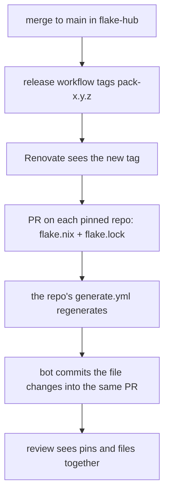

# Propagation

How a change here reaches the repos that use it.

## Tags

Every pack is tagged `<pack>-<semver>` on this one repo — `golden-base-0.1.0`,
`golden-service-0.2.0`. The tags share a namespace, so the Renovate preset
anchors its version match per pack. A pattern that matched `.*` would offer
`golden-infra` versions for a `golden-base` pin.

## The VERSION check

Each pack directory holds a `VERSION` file. A PR that changes a pack directory
without changing its `VERSION` fails `version-bump-check.yaml`. That is what
keeps a released tag from ever meaning two different trees.

## Why generation runs in the consumer

Renovate updates pins. It does not know how to regenerate files, and teaching it
would mean giving it the whole engine.

Instead the consumer's `generate.yml` runs on the PR, regenerates, and commits
the result back — but only when the PR author is `renovate[bot]`. On a human PR
it reports drift without committing.

The commit-back uses the workflow's `GITHUB_TOKEN`. Pushes made with that token
do not trigger further workflow runs, which is the loop prevention: the bot
commit cannot start another generate run that makes another bot commit.
